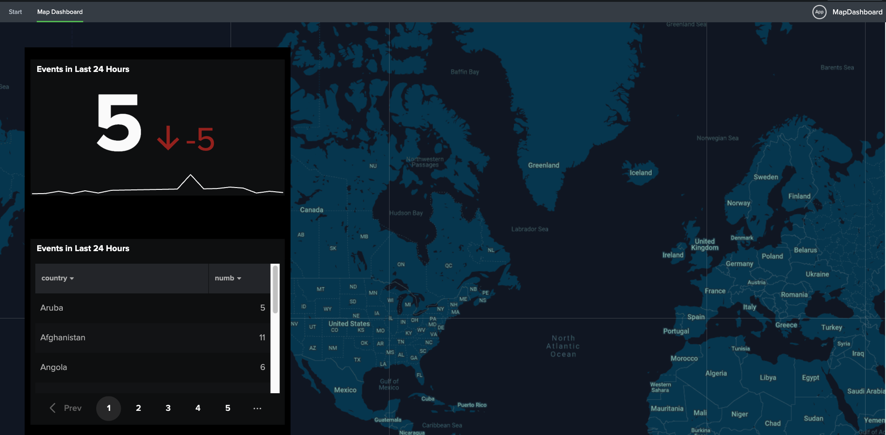

# Getting Started with Dashboards: Add a 3rd Party Component

# Introduction

In this tutorial, we will be going over how to integrate a 3rd party component (in this case, Google Maps) into a Splunk Dashboard. It is best to visit other tutorials to get an understanding on how to start and structure your Dashboard project first before trying this tutorial.

This project uses the `react-google-maps` package as well as the GoogleMaps JavaScript API. You can see the work of the original creator of the project [here](https://tomchentw.github.io/react-google-maps/#introduction), as well as on [npm](https://www.npmjs.com/package/react-google-maps) and [GitHub](https://github.com/tomchentw/tomchentw.github.io). This tutorial and particularly the code to get the Google Map component integrated is based on a project done by another Splunker, which expands on using Google Maps as a means of marking and tracking supply at various points of interests and seeing details by generating another dashboard on a click event. You can check out that project [here](https://github.com/splunk/supply-chain-tracking).

In this tutorial we will...

-   Create a Splunk App using the `splunk-create` app generator
-   Install dependencies for all necessary packages (will require some waiting while commands run)
-   Create a dashboard using out-of-the-box functionality from Splunk
-   Test our dashboard
-   Add a Google Map visualization utilizing `react-google-maps` and Splunk Visualization packages
-   View our map within our dashboard by creating a custom preset

## Prerequisites

-   node version 14.18.0
-   yarn version 1.2 or higher
-   A comprehensive code editor you are comfortable using
-   A local Splunk Enterprise Instance

The more experience one has with Javascript, React and JSX, the easier it is to understand the content, however this tutorial is not meant to cover the details regarding those development tools. This tutorial is based on the foundations provided in other tutorials, so it won't go into as much detail regarding generating and initializing the project. There is the additional requirement that to generate the Google Map, you require an API key for the Google Maps Javascript API. Using this API may incur costs so please refer to the Google Maps API documentation to learn more on potential costs and how to set up your key.

If you want to know more about project setup, and why we use certain commands in certain areas, checkout the first installment of the dashboard tutorials, or for the best explanation, the original [Splunk UI package tutorials](https://splunkui.splunkeng.com/Create/Overview).

## Setup and App Generation

To get started open a terminal in a directory where you feel comfortable creating this app in (for example, your desktop or user home directory). In that directory, we will create a new directory and execute the command to create our repository:

```bash
$ mkdir -p dashboardTutorial3
$ cd dashboardTutorial3
$ npx @splunk/create
```

You should see a selection menu with two options. Select the option that states `A monorepo with a React Splunk app with a React component`. Name the component `googleMap`, the repository `dashboardTutorial3` and the app `mapDashboard`.


For more details on the Splunk UI create package, see **Additional Reading**.

# Creating the Dashboard

## Overview

Like in previous tutorials, we will go through the steps of creating a new dashboard as part of our application before we work on getting the custom components in.

The best way to do the rest of this tutorial is to use an a code editor of your choice. The screenshots in this tutorial will show the use of VSCode, which provides the ability to open terminals and view the file structure of your project.

## Dashboard Setup

Find the folder `dashboardTutorial3` on your machine, which is where we created our repository. Drag and drop this folder into a new window of VSCode (or your equivalent code editor). You should be able to see the entire file structure and a workspace to edit files.

1.  Create a new folder in the `packages/map-dashboard/src/main/webapp/pages` directory

1.  Name the folder `MapDashboard`

1.  Create three new files in this folder, `definition.json`, `index.jsx` and `DashboardExample.jsx`

We need a starter definition for the dashboard. We can do so by going into any Splunk Enterprise instance and creating a dashboard with Dashboard Studio. In this tutorial, we have a dashboard that consists of a simple panel with a single value visualization, and a table containing `geoJson` data. This dashboard also uses test data, so there is no worry that this will index or run a search when loading into your Splunk instance.

#### definition.json (starter)

```json
{
	"visualizations": {
		"viz_WseZo4vD": {
			"type": "splunk.rectangle",
			"options": {
				"fillColor": "#000000",
				"strokeColor": "transparent"
			}
		},
		"viz_xrDJkDXT": {
			"type": "splunk.singlevalue",
			"title": "Events in Last 24 Hours",
			"dataSources": {
				"primary": "test1"
			},
			"options": {
				"trendColor": "> trendValue | rangeValue(trendColorEditorConfig)"
			},
			"context": {
				"trendColorEditorConfig": [
					{
						"to": 0,
						"value": "#9E2520"
					},
					{
						"from": 0,
						"value": "#1C6B2D"
					}
				]
			}
		},
		"viz_wg4huVXM": {
			"type": "splunk.table",
			"title": "Events in Last 24 Hours",
			"dataSources": {
				"primary": "ds_search1"
			},
			"options": {
			}
        }
	},
	"dataSources": {
		"test1": {
			"type": "ds.test",
			"name": "test",
			"options": {
				"data": {
					"fields": [
						{
							"name": "count"
						}
					],
					"columns": [
						[
							"0",
							"1",
							"10",
							"1",
							"12",
							"3",
							"14",
							"15",
							"16",
							"17",
							"18",
							"19",
							"78",
							"20",
							"21",
							"27",
							"23",
							"3",
							"10",
							"5"
						]
					]
				}
			}
		},
		"ds_search1": {
			"type": "ds.search",
			"options": {
				"queryParameters": {
					"earliest": "-24h@h",
					"latest": "now"
				},
				"query": "|  inputlookup geo_attr_countries\n|  eval numb=len(country)\n|  eval numby=numb*3\n|  fields country, numb"
			},
			"name": "Search_1"
		}
	},
	"defaults": {},
	"inputs": {},
"layout": {
	"type": "absolute",
	"options": {
		"display": "auto-scale",
		"width": 1440,
		"height": 1024
	},
	"structure": [
		{
			"item": "viz_CustomMap",
			"type":"block",
			"position":{
				"x":0,
				"y":0,
				"w":1440,
				"h":1024
			}
		},
			{
				"item": "viz_WseZo4vD",
				"type": "block",
				"position": {
					"x": 40,
					"y": 40,
					"w": 430,
					"h": 630
				}
			},
			{
				"item": "viz_xrDJkDXT",
				"type": "block",
				"position": {
					"x": 50,
					"y": 60,
					"w": 410,
					"h": 220
				}
			},
			{
				"item": "viz_wg4huVXM",
				"type": "block",
				"position": {
					"x": 50,
					"y": 350,
					"w": 410,
					"h": 300
				}
			}
		],
		"globalInputs": []
	},
	"description": "",
	"title": "Custom Component"
}

```

To be able to render the dashboard, we will need to include code to both the `DashboardExample.jsx` and `index.jsx` files. In this starter code for `DashboardExample.jsx`, we use these packages to create our dashboard in the layout section. We provide dashboard core with the props it requires, which includes the definition of our dashboard and the preset we want to use. This is then wrapped in both Dashboard Context and Splunk Theme providers. Notice that in this example we also have the GeoRegistry and GeoJson provider, as this will assist in adding data from a built-in lookup into our dashboard. More information on how these components work together can be found in our documentation in the **Additional Reading** section.

#### DashboardExample.jsx (starter)

```jsx
import React from "react";
import DashboardCore from "@splunk/dashboard-core";
import {
  DashboardContextProvider,
  GeoRegistry,
  GeoJsonProvider,
} from "@splunk/dashboard-context";
import SplunkThemeProvider from "@splunk/themes/SplunkThemeProvider";
import EnterpriseViewOnlyPreset from "@splunk/dashboard-presets/EnterpriseViewOnlyPreset";
import definition from "./definition.json";


const themeToVariant = {
  enterprise: { colorScheme: "light", family: "enterprise" },
  enterpriseDark: { colorScheme: "dark", family: "enterprise" },
  prisma: { colorScheme: "dark", family: "prisma" },
};
// use DashboardCore to render a simple dashboard

const geoRegistry = GeoRegistry.create();
geoRegistry.addDefaultProvider(new GeoJsonProvider());

const DashboardExample = () => {
  return (
    <SplunkThemeProvider {...themeToVariant.prisma}>
      <DashboardContextProvider geoRegistry={geoRegistry}>
        <DashboardCore
          width="100%"
          height="100%"
          preset={EnterpriseViewOnlyPreset}
          definition={definition}
        />
      </DashboardContextProvider>
    </SplunkThemeProvider>
  );
};

export default DashboardExample;

```

And for our `index.jsx`:

#### index.jsx

```jsx
import React from "react";
import layout from "@splunk/react-page";
import DashboardExample from "./DashboardExample";

layout(<DashboardExample />, {
  pageTitle: "Map Dashboard",
  hideFooter: true,
  layout: "fixed",
});

```

Next, we need to configure the app navigation to allow us to view our dashboard. To do this, we will do the following:

1.  Create a new page in `src/main/resources/splunk/default/data/ui/views`

1.  For this project, you can duplicate the `start.xml` view that is already provided and rename the file to `MapDashboard.xml`

1.  Replace the word "Start" with "Map Dashboard" in the XML file itself, between the `<label>` tags (It is important to note that the name of the xml view must be the same as the name of the folder you created in the previous set of steps)

1.  Go to `src/main/resources/splunk/default/data/ui/nav/default.xml` in the nav folder

1.  Once that is done you can add the following to the `default.xml` file, under the start view: `<view name="MapDashboard"/>`

## Test Run

Now that we have the code in place, let's do a test run before we dive into the "custom" portion of this tutorial. Open a new terminal window in VSCode (or use a regular terminal window). We will run a set of commands that will install new dependencies for dashboard related packages, install dependencies that are generated from the splunk-create package and build our project.

```bash
$ cd dashboardTutorial3/packages/map-dashboard #(if not in app root already)
$ yarn add @splunk/dashboard-core @splunk/dashboard-presets @splunk/dashboard-context @splunk/visualization-context
$ yarn install # to install other dependencies
$ yarn run build
```

This will make sure that all our dependencies are installed and that our React component and Splunk app can work together. Next we must symlink our output directory to our Splunk application directory, so that our local Splunk instance can load this app. Note that this above requires `$SPLUNK_HOME` to be set to the installation directory of the local Splunk installation you want to use. If this is **not done already**, then for a local, non-production instance, this can easily be done with:

```bash
$ export SPLUNK_HOME=<your_directory> #(note that most single instance Splunk downloads would be in /Applications/Splunk for Mac users)
```

And to get everything linked:

```bash
$ cd packages/map-dashboard #(app directory)
$ yarn run link:app
```

Now let's compile the app in watch mode:

```bash
$ yarn run start
```

If your Splunk instance is already running, you will have to restart it to pick up the new app view. Once it is restarted, you should be able to access the new app from the Splunk Enterprise Web interface. Assuming that the Splunk instance is listening on the default port, you should be able to see it at [http://localhost:8000/en-US/app/map-dashboard/MapDashboard](http://localhost:8000/en-US/app/map-dashboard/MapDashboard). This page should look familiar, everything should be the same as a regular Splunk Enterprise experience but you should be seeing the starter definition of the dashboard that is provided in the tutorial. If everything looks good we can move on.

### Common Issues

-   "Nothing works, not even the app is appearing in my application menu"
    -   Double check that you symlinked the application directory correctly, you can check in `package.json` of the app directory whether or not the application directory shows up correctly, under the `scripts` object, look for `link:app`
-   "I can see the app, but nothing loads"
    -   Check to see that you saved all your files after inserting the provided code
-   Error 404, page not found
    -   Check to see that you correctly created your view in the `src/main/resources/splunk/default/data/ui` directory. Remember you need to both create the view itself and then add the view in the `default.xml` file.


## Adding our Google Map Functionality

Now that we have our app going, our dashboard loaded and confirmed everything is rendering as expected, we can now add in our 3rd party functionality. At a high level, we will do the following steps:

1.  Acquire a map style definition

1.  Create a Google Map React component that uses the map style we selected (the API key will be used here)

1.  Make a custom visualization out of that component

1.  Adjust our `DashboardExample.jsx` to include the custom visualization as part of a custom preset

1.  Edit our dashboard definition to include that custom visualization

### Acquiring a Map Style

A Map style is a json file generated by Google, which you can get from [this link](https://mapstyle.withgoogle.com/). You can select what theme the map should be as well as many other settings regarding various map features. In this example we simply selected the Aubergine theme because it would look nice with the enterprise dark theme we already have. By clicking finish, a modal should appear with some JSON you can copy.

To add this definition to our project, we will use the React component package that splunk-create generated for us. Navigate to `/dashboardTutorial3/packages/google-map/src` and create a new file called `map-style.json` and paste the JSON from the map style.

#### map-style.json

```json
[
    {
      "elementType": "geometry",
      "stylers": [
        {
          "color": "#1d2c4d"
        }
      ]
    },
    {
      "elementType": "labels.text.fill",
      "stylers": [
        {
          "color": "#8ec3b9"
        }
      ]
    },
    {
      "elementType": "labels.text.stroke",
      "stylers": [
        {
          "color": "#1a3646"
        }
      ]
    },
    {
      "featureType": "administrative.country",
      "elementType": "geometry.stroke",
      "stylers": [
        {
          "color": "#4b6878"
        }
      ]
    },
    {
      "featureType": "administrative.land_parcel",
      "elementType": "labels.text.fill",
      "stylers": [
        {
          "color": "#64779e"
        }
      ]
    },
    {
      "featureType": "administrative.province",
      "elementType": "geometry.stroke",
      "stylers": [
        {
          "color": "#4b6878"
        }
      ]
    },
    {
      "featureType": "landscape.man_made",
      "elementType": "geometry.stroke",
      "stylers": [
        {
          "color": "#334e87"
        }
      ]
    },
    {
      "featureType": "landscape.natural",
      "elementType": "geometry",
      "stylers": [
        {
          "color": "#023e58"
        }
      ]
    },
    {
      "featureType": "poi",
      "elementType": "geometry",
      "stylers": [
        {
          "color": "#283d6a"
        }
      ]
    },
    {
      "featureType": "poi",
      "elementType": "labels.text.fill",
      "stylers": [
        {
          "color": "#6f9ba5"
        }
      ]
    },
    {
      "featureType": "poi",
      "elementType": "labels.text.stroke",
      "stylers": [
        {
          "color": "#1d2c4d"
        }
      ]
    },
    {
      "featureType": "poi.park",
      "elementType": "geometry.fill",
      "stylers": [
        {
          "color": "#023e58"
        }
      ]
    },
    {
      "featureType": "poi.park",
      "elementType": "labels.text.fill",
      "stylers": [
        {
          "color": "#3C7680"
        }
      ]
    },
    {
      "featureType": "road",
      "elementType": "geometry",
      "stylers": [
        {
          "color": "#304a7d"
        }
      ]
    },
    {
      "featureType": "road",
      "elementType": "labels.text.fill",
      "stylers": [
        {
          "color": "#98a5be"
        }
      ]
    },
    {
      "featureType": "road",
      "elementType": "labels.text.stroke",
      "stylers": [
        {
          "color": "#1d2c4d"
        }
      ]
    },
    {
      "featureType": "road.highway",
      "elementType": "geometry",
      "stylers": [
        {
          "color": "#2c6675"
        }
      ]
    },
    {
      "featureType": "road.highway",
      "elementType": "geometry.stroke",
      "stylers": [
        {
          "color": "#255763"
        }
      ]
    },
    {
      "featureType": "road.highway",
      "elementType": "labels.text.fill",
      "stylers": [
        {
          "color": "#b0d5ce"
        }
      ]
    },
    {
      "featureType": "road.highway",
      "elementType": "labels.text.stroke",
      "stylers": [
        {
          "color": "#023e58"
        }
      ]
    },
    {
      "featureType": "transit",
      "elementType": "labels.text.fill",
      "stylers": [
        {
          "color": "#98a5be"
        }
      ]
    },
    {
      "featureType": "transit",
      "elementType": "labels.text.stroke",
      "stylers": [
        {
          "color": "#1d2c4d"
        }
      ]
    },
    {
      "featureType": "transit.line",
      "elementType": "geometry.fill",
      "stylers": [
        {
          "color": "#283d6a"
        }
      ]
    },
    {
      "featureType": "transit.station",
      "elementType": "geometry",
      "stylers": [
        {
          "color": "#3a4762"
        }
      ]
    },
    {
      "featureType": "water",
      "elementType": "geometry",
      "stylers": [
        {
          "color": "#0e1626"
        }
      ]
    },
    {
      "featureType": "water",
      "elementType": "labels.text.fill",
      "stylers": [
        {
          "color": "#4e6d70"
        }
      ]
    }
  ]
```
### Create a Google Map React Component

Since the `splunk-create` package already created a component for us (which should be named `GoogleMap.jsx`) we can change the code here to make our map component. You can find the code below, but for more detail on the `react-google-map` component as a whole, and what the code does, please check out the original documentation linked above. Notice in the code we use our style JSON in the `mapStyleDark` variable. Options are also set for the map, including the ability to scroll, drag and scale. Lastly, notice that in the return statement, there is a definition for `googleMapURL` this is where you can place your API key within the provided tag.

#### GoogleMap.jsx

```jsx
import React from 'react';
import { withScriptjs, withGoogleMap, GoogleMap } from 'react-google-maps';
import SplunkVisualization from '@splunk/visualizations/common/SplunkVisualization';
import mapStyleDark from './map-style.json';

const MyMapComponent = withScriptjs(
    withGoogleMap(() => (
        <GoogleMap
            defaultZoom={3}
            defaultCenter={{
                lat: 40.7484445, // latitude for the center of the map
                lng: -73.9878584, // longitude for the center of the map
            }}
            defaultOptions={{
                styles: mapStyleDark,
                disableDefaultUI: true, // disable default map UI
                draggable: false, // make map draggable
                keyboardShortcuts: false, // disable keyboard shortcuts
                scaleControl: false, // allow scale control
                scrollwheel: false, // allow scroll wheel
            }}
        />
    ))
);

const CustomMap = () => {
    return (
        <MyMapComponent
            googleMapURL="https://maps.googleapis.com/maps/api/js?v=3.exp&libraries=geometry,drawing,places&key=<YOUR_KEY_HERE>"
            loadingElement={<div style={{ height: `100%` }} />}
            containerElement={<div style={{ height: `calc(100vh - 10px)` }} />}
            mapElement={<div style={{ height: `100%` }} />}
        />
    );
};

CustomMap.propTypes = {
    ...SplunkVisualization.propTypes,
};

CustomMap.defaultProps = {
    ...SplunkVisualization.defaultProps,
};

export default CustomMap;

```
In the above code, we also used the `SplunkVisualization` base component from the Splunk Visualizations package. This allows us to turn the React component we made into a visualization that can be then be used and referenced in our dashboard definition.

### Adding the Custom Visualization in our Dashboard

The last step needed is to make sure our dashboard can use this new custom visualization. The following code block shows the changes needed to be made in the source definition.

1.  Go to the dashboard `definition.json` and add a new visualization at the top of the visualizations stanza as shown below

1.  Add a new block in the layout stanza for the map and make it equal to the height and width of the dashboard so it can become the background

#### definition.json (change)

```json
"visualizations": {
    "viz_CustomMap":{
        "type":"splunk.CustomMap",
        "options":{},
        "dataSources":{}
    },

...

"layout": {
    "type": "absolute",
    "options": {
        "display": "auto-scale",
        "width": 1440,
        "height": 1024
    },
    "structure": [
        {
            "item": "viz_CustomMap",
            "type":"block",
            "position":{
                "x":0,
                "y":0,
                "w":1440,
                "h":1024
            }
        },
...
```

We need to now include it the custom visualization in the dashboard **preset**. We need to define a new preset and add the visualization to this preset, and then make sure **dashboard core** renders this new preset. All what was described is reflected with the following code change to the dashboard's `DashboardExample.jsx` file.

Replace the existing code in `DashboardExample.jsx` with the code in the following snippet `DashboardExample.jsx` final. 

#### DashboardExample.jsx (final)

```jsx
import React from "react";
import DashboardCore from "@splunk/dashboard-core";
import {
  DashboardContextProvider,
  GeoRegistry,
  GeoJsonProvider,
} from "@splunk/dashboard-context";
import SplunkThemeProvider from "@splunk/themes/SplunkThemeProvider";
import EnterpriseViewOnlyPreset from "@splunk/dashboard-presets/EnterpriseViewOnlyPreset";
import CustomMap from "@splunk/google-map";
import definition from "./definition.json";


const themeToVariant = {
  enterprise: { colorScheme: "light", family: "enterprise" },
  enterpriseDark: { colorScheme: "dark", family: "enterprise" },
  prisma: { colorScheme: "dark", family: "prisma" },
};
// use DashboardCore to render a simple dashboard

const geoRegistry = GeoRegistry.create();
geoRegistry.addDefaultProvider(new GeoJsonProvider());

const customPreset = {
  ...EnterpriseViewOnlyPreset,
  visualizations: {
    ...EnterpriseViewOnlyPreset.visualizations,
    "splunk.CustomMap": CustomMap,
  },
};

const DashboardExample = () => {
  return (
    <SplunkThemeProvider {...themeToVariant.prisma}>
      <DashboardContextProvider geoRegistry={geoRegistry}>
        <DashboardCore
          width="100%"
          height="100%"
          preset={customPreset}
          definition={definition}
        />
      </DashboardContextProvider>
    </SplunkThemeProvider>
  );
};

export default DashboardExample;

```

Once you replace the code, we should be good to go.

```bash
$ cd dashboardTutorial3 #(if not in project root already)
$ yarn run build
$ cd packages
$ yarn run start
```

Restart the Splunk Instance, and you should see the dashboard load as expected, you may need to do a hard refresh on your browser window (cmd+shift+R for Mac)

Notice that before we did the commands in the application directory, but now we are doing so in the package directory, because we need to build and start both the application _and_ the React component.

### Common Issues

-   "I still see a nothing instead of the map"
    -   Double check that you changed and saved the change to the definition and did a hard refresh.
-   "I get an undefined error where the map should be"
    -   Check to see that you are using the `customPreset` and not the original `EnterpriseViewOnlyPreset`
    -   Double check that the syntax matches in the definition of the `customPreset` and in the `definition.json` file.



## Review

Congratulations! You now have a Splunk App which contains a dashboard that has a custom, 3rd party component.

To recap what we did in this tutorial...

-   Used the `@splunk/create` package to generate an app containing a React component and Splunk app
-   Installed and added all packages required to render and customize our dashboard
-   Used a JSON definition and React file to create a dashboard
-   Linked our app to a local Splunk instance to view in Splunk Enterprise
-   Created a map component using `react-google-maps` and the Google Map Javascript API
-   Created a custom visualization that housed the map
-   Added the custom visualization as part of a custom preset as well as our dashboard JSON
-   Ran our dashboard with the interactive map component.

## Additional Reading

[Splunk UI Create Package](https://splunkui.splunk.com/Packages/create/Overview)

[Splunk Dashboard Packages](https://splunkui.splunk.com/Packages/dashboard-docs-public/?path=%2FIntroduction)
